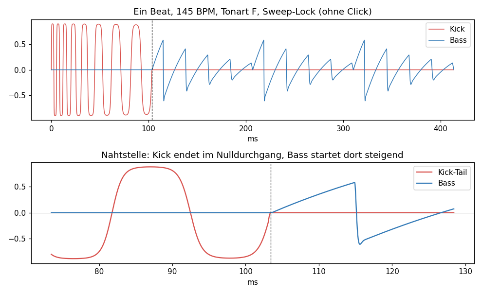
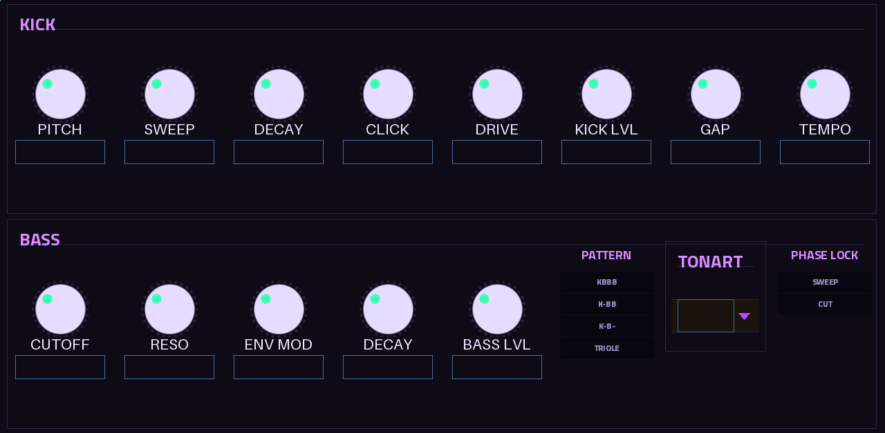

# KCB Psy – Psytrance Kick + Bass für die Akai Force

Kick (mit Click) und Rolling Bass aus **einer** Engine, samplegenau gekoppelt:
Der Kick-Tail endet exakt im Nulldurchgang, wo der erste Basston einsetzt, und
jeder Basston startet mit Phase-Reset bei 0 (steigende Flanke). Kick und Bass
überlappen nie, also keine Auslöschung.

Native VST2 für MPC OS, gebaut mit [sd88me/mpc-vst-plugins](https://github.com/sd88me/mpc-vst-plugins)
(gepinnt auf Commit `f373ae9`).



## Bedienung

- Plugin auf einen Track, dort **eine Note auf jede Viertel** (4-on-the-floor).
  Jede Note spielt Kick + Bass für diesen Beat.
- **Sync = Host** (Standard): Tempo kommt von der Force. **Intern**: Tempo-Regler.
- **Key Follow = An**: Die Tonhöhe der gespielten Note bestimmt die Tonart.
- **Phase Lock**
  - *Sweep*: Die Startfrequenz der Kick wird pro Beat minimal nachgestimmt (max. ±10 %),
    sodass die Kick genau beim Basseinsatz eine ganze Zahl Zyklen vollendet. Nahtloser Übergang.
  - *Cut*: Keine Nachstimmung, die Kick endet am letzten Nulldurchgang davor.
- **Gap**: bewusste Luft (ms) zwischen Kick-Ende und erstem Bass.

## Seiten und Q-Links

| Seite | Q-Link-Bank 1 | Q-Link-Bank 2 |
|---|---|---|
| KICK / BASS | Pitch, Sweep, Decay, Click, Drive, Kick Lvl, Gap, Tempo | Cutoff, Reso, Env Mod, Decay, Bass Lvl, Pattern, Tonart, Phase Lock |
| SETUP | Oktave, Key Follow, Sync, Pattern, Phase Lock | – |



## Aufbau

```
src/kcb_engine.c/.h   DSP (host-unabhängig, C99)
src/mpc_adapter.c     mpc_engine()-Adapter für wrapper/vst2_wrap.c
vst/vst.json          Port-Definition (Name, UID "KCBp", .so, Quellen)
vst/params.json       Parameter = VST-Index-Reihenfolge (nur anhängen, nie umsortieren!)
vst/layout.conf       Skin (Force-Shadow-Syntax, eigenes UV/Neon-Theme)
vst/fonts/            Titillium Web (OFL) für größere Titel- und Optionstexte
vst/build.sh          ruft tools/build_port.sh auf
test/kcb_test.c       Phasentest über 2304 Kombinationen + Demo-WAV
```

## Bauen über GitHub (ohne Terminal)

1. Neues Repo `kcb-psy` unter deinem Account anlegen und den Inhalt dieses Ordners hochladen.
2. **Actions → „KCB Psy release“ → Run workflow**, Version `0.1.0`, *dry_run* angehakt lassen.
3. Nach ein paar Minuten im Run unter **Artifacts** das Zip herunterladen
   (darin das Installationspaket und die Skin-Vorschauen).
4. Installieren wie beim Euclidier (Ordner nach `/tmp` kopieren, `sh install.sh`).
   **Das Installationsskript stoppt und startet MPC neu, vorher Projekt speichern.**
5. Wenn es auf der Force läuft: Workflow nochmal mit *dry_run* aus, dann entsteht ein Draft-Release.

Der Workflow `test` läuft bei jedem Push: Engine-Phasentest und der offizielle Wrapper-Hosttest.

## Lokal testen

```sh
make test                                              # Engine
../mpc-vst-plugins/tools/test_port.sh vst/vst.json     # Wrapper-Hosttest (Checkout daneben)
```

## Hinweise

- MIDI-Noten wirken an der nächsten 128-Sample-Blockgrenze (≤ 2,9 ms). Die Kopplung Kick ↔ Bass
  bleibt davon unberührt, sie entsteht intern samplegenau.
- CPU auf der Force noch nicht gemessen (`tools/bench.sh`); danach `vst/bench.txt` committen.
